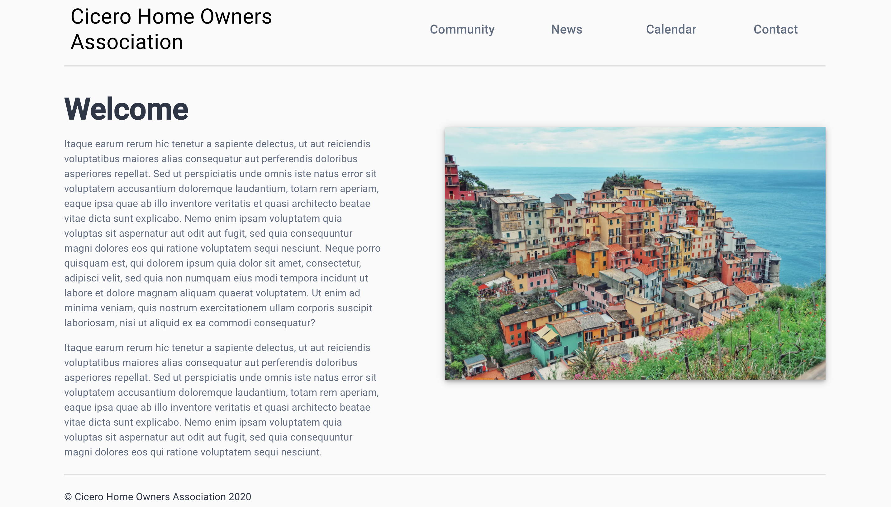

A starter template to build amazing static websites with Gatsby, Contentful and Netlify. Inspired by [gatsby-starter-minimal-blog](https://minimal-blog.lekoarts.de/). With setup help from [gatsby-starter-mate](https://github.com/EmaSuriano/gatsby-starter-mate).

#### [HOA Template](https://frosty-torvalds-822eb0.netlify.app/)



This starter is totally content based on [Contentful](https://contentful.com), which is a headless CMS where you can write the content for your page. In summary, Contentful is the Model when Gatsby with React is the View.

### Lighthouse Score


To copy and install this starter run this command:

```bash
git clone gatsby-starter-hoa;
npm install
```

At this point you have the repository download with all the dependencies installed, but if you try to start by running `gatsby develop` you are going to received this message in the console:

```bash
  TypeError: Expected parameter accessToken
```

This is because you didn't specify from which `Contentful` space the portfolio will take the information. So the next step is create an empty space in [Contentful](https://www.contentful.com/)!

After the space is created, run the following command:

```bash
npm run setup
```

This CLI will request 3 values:

- `Space ID`
- `Content Delivery API - access token`
- `Personal Access Token`

These 3 values are inside the Settings section --> API keys.

After you provide them the CLI will automatically starts copying all the `Content models` and `Contents` from `gatsby-starter-hoa` to your space ✨

If everything went smooth you should see something like this in your terminal:

```text
Writing config file...
Config file /Users/my-user/Git/test/mate-portfolio/.env written
┌──────────────────────────────────────────────────┐
│ The following entities are going to be imported: │
├─────────────────────────────────┬────────────────┤
│ Content Types                   │ 3              │
├─────────────────────────────────┼────────────────┤
│ Editor Interfaces               │ 3              │
├─────────────────────────────────┼────────────────┤
│ Entries                         │ 8              │
├─────────────────────────────────┼────────────────┤
│ Assets                          │ 6              │
├─────────────────────────────────┼────────────────┤
│ Locales                         │ 1              │
├─────────────────────────────────┼────────────────┤
│ Webhooks                        │ 0              │
└─────────────────────────────────┴────────────────┘
 ✔ Validating content-file
 ✔ Initialize client (1s)
 ✔ Checking if destination space already has any content and retrieving it (2s)
 ✔ Apply transformations to source data (1s)
 ✔ Push content to destination space
   ✔ Connecting to space (1s)
   ✔ Importing Locales (1s)
   ✔ Importing Content Types (4s)
   ✔ Publishing Content Types (3s)
   ✔ Importing Editor Interfaces (3s)
   ✔ Importing Assets (7s)
   ✔ Publishing Assets (3s)
   ✔ Archiving Assets (1s)
   ✔ Importing Content Entries (1s)
   ✔ Publishing Content Entries (5s)
   ✔ Archiving Entries (1s)
   ✔ Creating Web Hooks (0s)
Finished importing all data
```

After this step we can finally run the project and see the result in http://localhost:8000/ 😃

```bash
$ npm run develop
```

### Commands

#### `npm run develop`

Clear the cache and run the project locally with live reload in development mode.

#### `npm run build`

Run a production build into `./public`. The result is ready to be put on any static hosting you prefer.

#### `npm run serve`

Spin up a production-ready server with your blog. Don't forget to build your page beforehand.
